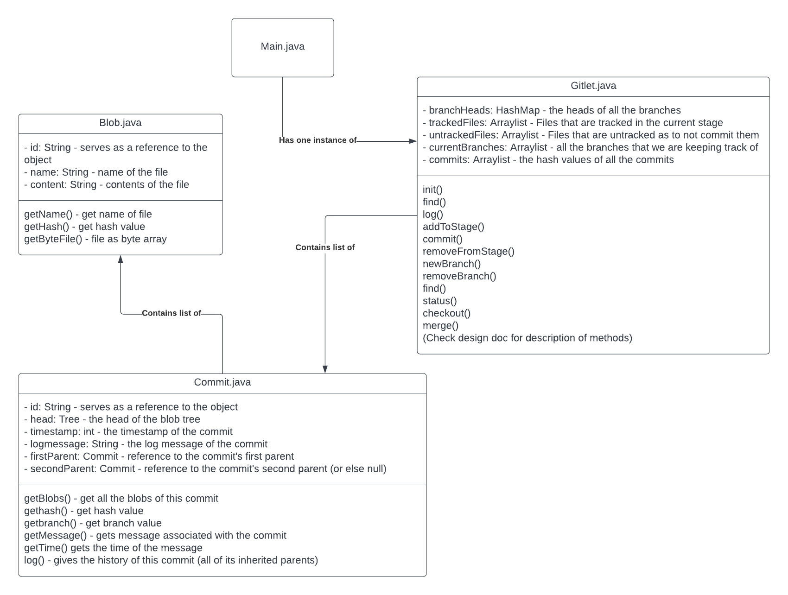

# Gitlet Design Document

**Name**: Eduard Mirzoyan

## Classes and Data Structures

### Blob.java
Contains information about files

#### Fields

1. String id - serves as a reference to the object
2. String name - name of the file
3. String content - contents of the file

### Commit.java
Combinations of log messages, other metadata (commit date, author, etc.), a reference to a tree, and references to parent commits.

#### Fields

1. String id - serves as a reference to the object
2. Tree head - the head of the blob tree
3. int timestamp - the timestamp of the commit
4. String logmessage - the log message of the commit
5. Commit firstParent - reference to the commit's first parent
6. Commit secondParent - reference to the commit's second parent (or else null)

### Gitlit.java
Contains most of the logic of creating, storing and managing commits. Most of the algothrims are going to be in this class. Commits will be stored as a hash-map of Ids and branch names

#### Fields
1. HashMap branchHeads - the heads of all the branches
2. Arraylist trackedFiles - Files that are tracked in the current stage
3. Arraylist untrackedFiles - Files that are untracked as to not commit them
4. ArrayList currentBranches - all current branches
5. ArrayList commits - the hash values of all the commits

## Algorithms

### Blob.java
getName() - get name of file

getHash() - get hash value

getByteFile() - file as byte array

### Commit.java
getBlobs() - get all the blobs of this commit

gethash() - get hash value

getbranch() - get branch value

getMessage() - gets message associated with the commit

getTime() gets the time of the message

log() - gives the history of this commit (all of its inherited parents)

### Gitlet.java
init() - creates a .gitlet directory and initializes hashMap

find() - rints out the ids of all commits that have the given commit message, one per line. If there are multiple such commits, it prints the ids out on separate lines.

log() - Starting at the current head commit, display information about each commit backwards along the commit tree until the initial commit, following the first parent commit links, ignoring any second parents found in merge commits.

addToStage() - Adds a copy of the file as it currently exists to the staging area

commit() - Saves a snapshot of tracked files in the current commit and staging area so they can be restored at a later time, creating a new commit. 

removeFromStage() - Unstage the file if it is currently staged for addition.

newBranch() - creates a new pointer at the head of the commit tree

removeBranch() - deletes the pointer of the given branch

find() - Prints out the ids of all commits that have the given commit message, one per line

status() - Displays what branches currently exist, and marks the current branch

checkout() - Takes the version of the file as it exists in the head commit, the front of the current branch, and puts it in the working directory, overwriting the version of the file that's already there if there is one. The new version of the file is not staged

merge() - Merges files from the given branch into the current branch.

## Persistence

`Commit.java` and `Blob.java` will use Serializable in order to be stored and acessed. `Gitlet.java` will be a singleton and will not be stored itself as a data structure. It will act as a "reader" and "writer" for the files in its CWD, without persiting itself. Gitlet will esstentially read all the files in its given directory and based on the state of the files, it will understand the current state of the repository. So as long as the files are in the correct places, opening gitlet at any computer should not cause problems. Files will be stored in `.gitlet`, in this format:

    .
    └── .gitlet/
        ├── staged
        ├── untacked
        └── all commits

## Design Diagram

